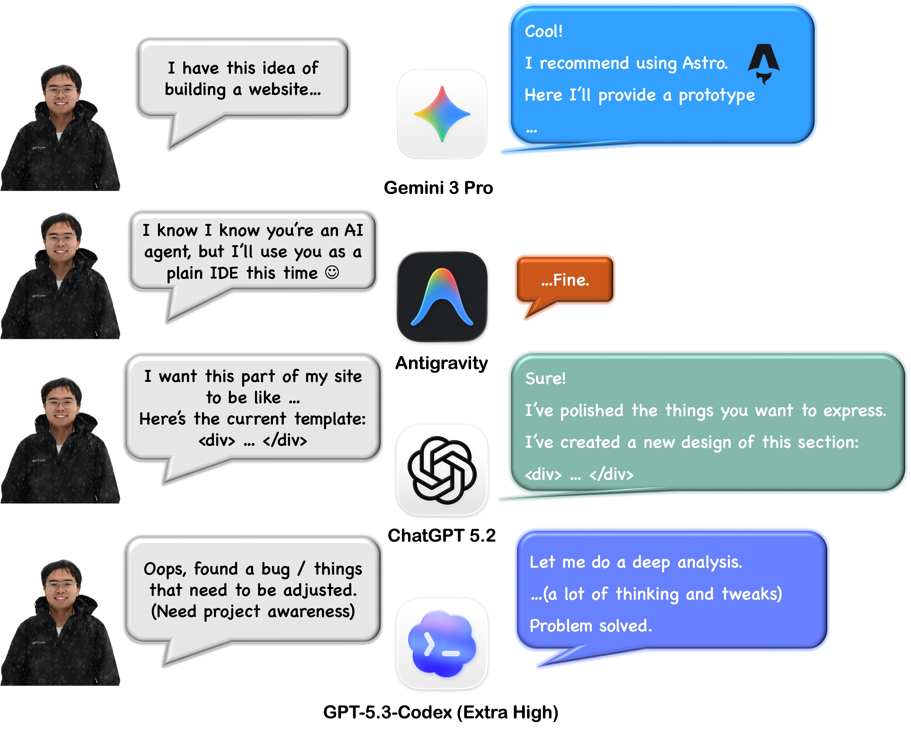

## The Website I Never Built

For years, I wanted a personal website.

Not because everyone else had one, and not as a portfolio checkbox, but because I liked the idea of owning a small corner of the internet — a place where research, experiments, and unfinished thoughts could exist outside slides, papers, or social media feeds.

The irony is that I study technology, write code almost every day, and still never managed to build one.

Each attempt followed the same pattern. I would start learning web development seriously: HTML, CSS, TypeScript. Then React appeared. Then build tools. Then frameworks built on frameworks. Somewhere along the way, the simple idea of “a personal site” turned into an endless prerequisite tree.

The activation energy was always just slightly too high.

I also had a stubborn constraint: if I built a website, I wanted to understand it. No black boxes, no drag-and-drop builders. I didn’t want something that merely worked — I wanted something I could *own* intellectually.

So the idea stayed unfinished.

---

## AI Changed the Starting Point

The shift happened quietly.

The first time I used Copilot, code completion already felt different. But large language models changed something deeper: they moved programming closer to conversation.

Instead of asking *“How do I implement this API?”*, you could start with *“I want a page that feels calm, minimal, and readable.”*

Last year, I accidentally proved this to myself while working on the Tsinghua AI Eye Clinic system. Despite barely understanding `.tsx`, I helped build and deploy a full-stack medical website using React, Tailwind, and FastAPI — largely through iterative collaboration with AI tools.

It worked.

But it also exposed a weakness: speed without understanding creates fragile systems. Every modification felt risky because I didn’t fully grasp what I had built.

So when winter break arrived and I finally had a few free days, I tried again — with a different rule:

**Use AI to accelerate learning, not to skip it.**

---

## Day 1 — Making Something Real

I started by talking to Gemini about possible stacks and discovered Astro.

Astro felt almost philosophical in its design. Ship less JavaScript. Treat content as primary. Keep things simple unless complexity is necessary. It aligned perfectly with what a personal website should be.

From there, progress became surprisingly fluid.

Through iterative conversations, I initialized the project, generated layouts, created navigation, and assembled reusable components. Instead of fighting syntax, I focused on describing intent: spacing, structure, interaction, feeling.

Within a few hours, the site existed.

Not perfect — but real. Clickable. Alive.

That moment matters more than people expect. Once something exists, momentum replaces hesitation.

---

## Day 2–3 — The Invisible Work

Building features is exciting. Polishing is where identity appears.

As the project grew, long AI chats became less effective. Context drifted. Style inconsistencies appeared. I switched to Codex for more surgical tasks: refactoring, debugging, enforcing structure.

It felt like pairing with an endlessly patient engineer.

Dark mode emerged. Layout bugs disappeared. Mobile responsiveness improved. Markdown rendering finally looked the way I imagined. Small usability decisions accumulated — like explicitly adding a “Home” button instead of hiding navigation behind a logo.

None of these changes were dramatic individually. Together, they transformed the site from a prototype into something intentional.

I realized design is mostly accumulation of small acts of care.

---

## Writing Was Harder Than Coding

The surprising difficulty was not technical — it was personal.

AI can generate endless text, but a personal website forces an uncomfortable question: *how do you describe yourself honestly?*

I often drafted rough ideas, then asked ChatGPT to polish wording or suggest alternatives. The results were impressive, sometimes unsettling. Modern models remember fragments of you, and occasionally invent the rest. At one point, Gemini confidently decided I had a physics degree from Peking University and wrote a thesis on photonic crystals.

I laughed — but it revealed something interesting.

AI doesn’t know who you are. It extrapolates from patterns.

And in a way, building a personal website is doing the same thing yourself — constructing a coherent story from scattered experiences.

The finished site probably makes my life look colorful and balanced. In reality, most days are slow, repetitive, and occasionally frustrating. Research often is.

But maybe that’s not dishonesty. Maybe it’s direction.

You design toward the person you are becoming.

---

## Workflow of Building This Site

---

## What Actually Happened in Three Days

Technically, the website took only a few spare hours each day across three days.

But the real change wasn’t productivity. It was the workflow.

Programming used to mean translating thoughts into syntax. Now it increasingly means translating intent into systems — with AI acting as an amplifier rather than an author.

The barrier between *having an idea* and *building something real* has collapsed dramatically.

And once that barrier disappears, you start building more.

Not because you have to — but because you finally can.

If you’ve been postponing something you want to create, this might be the easiest moment in history to start.
